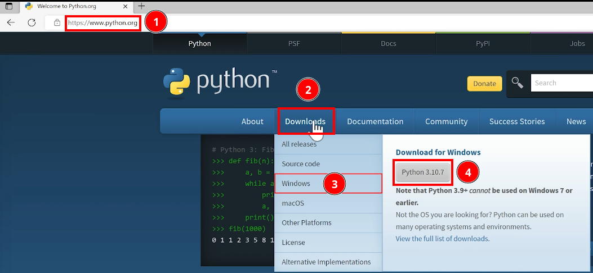
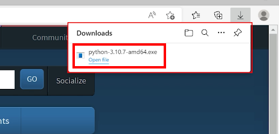
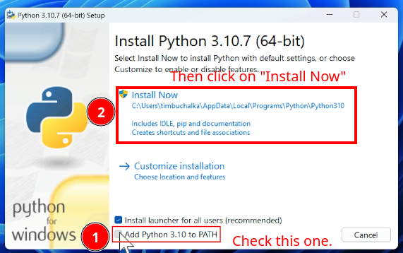
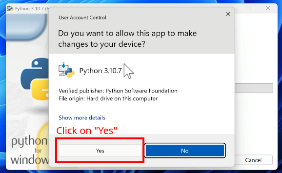
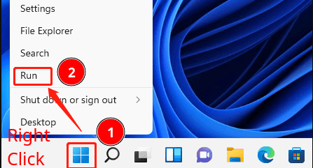
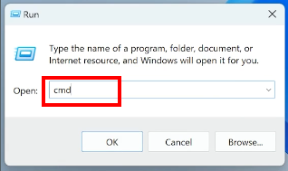
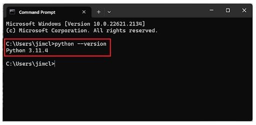

# Installing Python

## Windows

After it finished downloading, open the downloaded file.

Then you must check the option to add python to your path:

Allow python installer make changes on your device:

Confirm python installation:

Open CMD:

Type `python --version` and hit enter:

