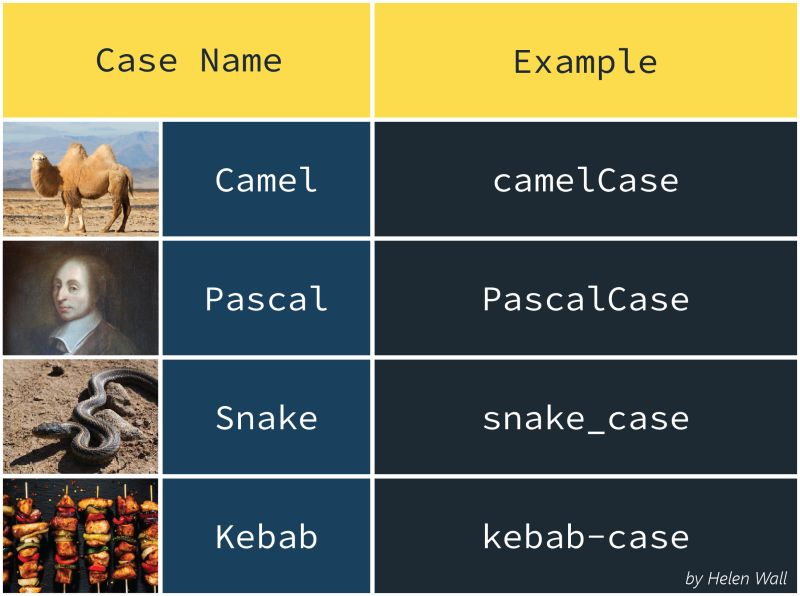
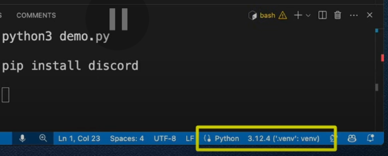
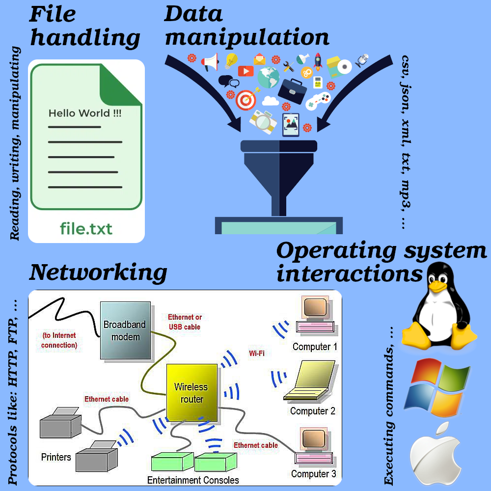

# Installing Python Interpreter

## What is an Interpreter?

You might wanna ask what is interpreter, in the layman's terms (tell me like i am 5), it is a software that:

1. Takes your python code.
2. Read the first line.
3. Translate it to what computers understand.
4. Execute the translated result.
5. Computer act upon it.
6. It goes to the next line.
7. If there is more code, it repeats steps 3 to 6 until it finishes executing your python code.

> [!NOTE]
>
> Number systems: binary, octal, decimal, hexadecimal
>
> 

## Windows

After it finished downloading, open the downloaded file.

Then you must check the option to add python to your path:

Allow python installer make changes on your device:

Confirm python installation:

Open CMD:

Type `python --version` and hit enter:

# IDE -- VSCode

There might be others who use things like [PyCharm](https://www.jetbrains.com/pycharm/), [Intellij IDEA](https://www.jetbrains.com/idea/). BTW Python wiki also has somethings to say about this. So if you're interested in their recommendations please read [this](https://wiki.python.org/moin/IntegratedDevelopmentEnvironments).

> [!NOTE]
>
> IDE stands for **I**ntegrated **D**evelopment **E**nvironment.

## Download & installation

1. Download it from [here](https://code.visualstudio.com/).
2. Open it and accept terms of service:

   

3. Pick a location on your hard drive if you like, but like I've already suggested in the folowing screenshot, do not change if you do not have any reason to do so and just click on "Next":

   

4. .
5. Create its icon on desktop if you like, but those two other options will make your life much much easier:

   

6. 
7. 

## Configurations

1.  Choose a theme:

    

2.  Install ["Python"](https://marketplace.visualstudio.com/items?itemName=ms-python.python) extension for VSCode. This will give you stuff like:
    - IntelliSense (Through Pylance extension).
    - Debugging (Through Python Debugger extension).
    - Formatting, linting, code navigation, refactoring, variable explorer, test explorer, and other convenience you might need while coding.

## Create a new python project

1. Create a new directory/folder on your desktop and call it "projects":

   

2. Open it and inside it create a new directory called "HelloWorld".

   BTW this is a naming convention 

3. Open "HelloWorld" with VSCode.

   You can do it inside file explorer:

   

   Or through VSCode:

   

## Creating a virtual environment

- For your Python projects we need to create what is called virtual environment which is necessary.
- You can have multiple Python project which use different version of Python, thus you cannot every time for every project just reinstall it, right?
- We also might install 3rd party libraries, in which we do not wanna pollute our global environment.

1. Open Command Palette and type "Python create Environment": 
2. Press enter.
3. Wait until it is done creating your virtual environment: 
4. You can see that now your virtual env is dictating which Python version should be used in that project: 

## VScode shortcut keys

- Press `ctrl + z` to undo your changes. 
- Press `ctrl + y` to redo. 
- Press `ctrl + d` to kill a REPL. 
- Press <code>ctrl + `</code> to open terminal (it is called command prompt in windows): 
- Press `ctrl + shift + p` to open "command palette". .

  - Here we can do things like opening a REPL: 

## Final words

Do not be afraid of reading docs. I wanna show you how you could accomplish same results by just reading VSCode's official documentations:

1. Install VSCode on windows: search in google "Install VSCode on Windows".
2. How to configure newly installed VSCode for Python in Windows: Search in Google: "VSCode + windows + python".
3. How to know which short cut does what in VSCode. Google "VSCode shortcuts" or "VSCode shortcuts cheat sheet".

## YouTube/Aparat

- https://youtu.be/qPH9oLuTBQk
- https://aparat.com/v/eyj6b83

# Python

- "Python" is actually a category of snakes:
  - It's not the name of a specific species.
  - It refers to a family of snakes called Pythonidae.
  - Known for their large size & non-venomous constriction method of hunting.
- But here we are talking about a programming language :).

## Why Python

### Powerful

- Can be extended/combined with other [programming languages](./glossary.md#programmingLanguageGlossary).

  

  Imagine you have a big Lego set with pieces that build almost anything, but there are a few things you want to make that need super-special pieces that aren’t in the set. So, you ask someone who has those special pieces (like shiny or super-strong ones) to build those parts for you. Then, you add them to your Lego set, and now you can build even cooler stuff!

- Extensive standard [library](./glossary.md#libraryGlossary); i.e. large collection of [modules](./glossary.md#moduleGlossary) and packages built into the language.
  

### Versatile

- Can be used in different fields, domains, or types of [applications](./glossary.md#applicationGlossary).

  

- Runs everywhere.

  

### Easy to learn

- Some blogs, podcasts:
- [RealPython](https://realpython.com/).
- [Planet Python](https://planetpython.org/).
- [Podcast about Python](https://talkpython.fm/).
- [Mouse vs. Python](https://www.blog.pythonlibrary.org/).
- Here are some online courses:
  - [edX](https://www.edx.org/learn/python).
  - [Python Essentials 1](https://www.netacad.com/courses/python-essentials-1?courseLang=en-US).
- And if you had any question you can ask in:
  - [Stackoverflow](https://stackoverflow.com/).
  - [Reddit's community for Python](https://www.reddit.com/r/Python/).

### Talk more technical

- Is equipped with efficient high-level [data structures](./glossary.md#dataStructureGlossary).
- Has an effective approach to [Object-Oriented Programming](./glossary.md#objectOrientedProgrammingGlossary).

  - Simplicity and readability: no steep learning curve.
  - Flexibility with multiple paradigms: sometimes you need to [mix and match](https://www.collinsdictionary.com/dictionary/english/mixdown).
  - Built-in support for OOP principles.

    

- Dynamically typed: no need to explicitly declare variable types, resulting in a faster and easier development experience.

  

- [Interpreted](#what-is-an-interpreter) programming language.

## So what now?

First we're gonna touch the most noteworthy aspects of Python. By the end of this journey we will be able to read and understand Python. Then we can jump into next section which is libraries that we need.

> [!NOTE]
>
> My goal here is to equip you with as much as arsenal I can so when you're out fighting your own battle you know how to read docs, ask questions, solve your problems and be a good developer.

### Download and print [this cheatsheet](./assets/cheatsheets/)

## Resources to practice Python

- https://checkio.org.
- https://www.afterhoursprogramming.com/tutorial/python/python-quiz.
- https://www.practicepython.org.
- https://pychallenger.com.

### Refs

- https://wiki.python.org/moin/BeginnersGuide.
- https://wiki.python.org/moin/BeginnersGuide/Overview.
