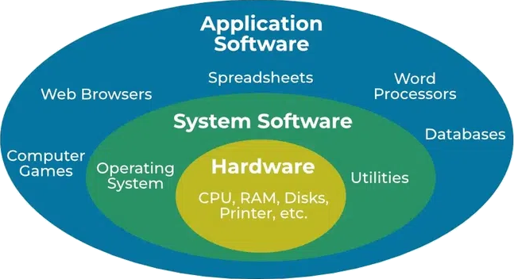

# Glossary

- https://docs.python.org/3/glossary.html#glossary

<dl>
  <dt id="libraryGlossary">
    <a href="#libraryGlossary">#</a>
    Library
  </dt>
  <dd>
    A collection of pre-written code that you can use to perform specific tasks without building everything from scratch.
  </dd>
  <dd>
    Tell me like I am five: Imagine you have a big box full of toys, puzzles, and tools that help you do fun things, like building blocks to make a castle or crayons to draw a picture. Each toy or tool in the box saves you time because you don’t have to make it yourself—it’s just ready to use whenever you need it.
  </dd>
  <dd>
    <a href="https://en.wikipedia.org/wiki/Library_(computing)">
      Wikipedia: Library (computing)
    </a>
  </dd>
  <dt id="programmingLanguageGlossary">
    <a href="#programmingLanguageGlossary">#</a>
    Programming language
  </dt>
  <dd>
    A set of instructions written by a programmer to deliver instructions to the computer to perform and accomplish a task.
  </dd>
  <dd>
    A set of instructions that enables humans to communicate with computers.
  </dd>
  <dd>
    <a href="https://github.com/resources/articles/software-development/what-is-a-programming-language">
      GitHub: What is a programming language?
    </a>
  </dd>
  <dt id="moduleGlossary">
    <a href="#moduleGlossary">#</a>
    Module
  </dt>
  <dd>
    Same meaning as the library, but sometimes can be used as an adjective too. Something composed of smaller, independent parts (modules) that can be combined or arranged in different ways.
  </dd>
  <dt id="applicationGlossary">
    <a href="#applicationGlossary">#</a>
    Application
  </dt>
  <dd>
    A computer program designed to help people perform an activity.
  </dd>
  <dd>Abbreviation: app.</dd>
  <dd>AKA application program, or application software.</dd>
  <dd></dd>
  <dt id="dataStructureGlossary">
    <a href="#dataStructureGlossary">#</a>
    Data structure
  </dt>
  <dd>
    A way of organizing and storing data in a computer so that it can be accessed and used efficiently.
  </dd>
  <dd>Any "container" in which data can be stored and accessed.</dd>
  <dt id="objectOrientedProgrammingGlossary">
    <a href="#objectOrientedProgrammingGlossary">#</a>
    Object-Oriented Programming
  </dt>
  <dd>
    A computer programming model that <b>organizes software design around data, or objects, rather than functions and logic</b>.
  </dd>
  <dd>
    tell me like I am 5: You have different toys, like action figures, cars, and dolls. <b>Each</b> toy is different, but they can have <b>things in common</b> too -- like each one might have a color, a size, and things it can do (like move or make sounds).
  </dd>
  <dd>
    You might be confused with "rather than functions and logic" since if you think about it a toy making a sound is a function. So does not that goes against our definition for OOP?
     
    Nope, let's break it down:
    <ol>
      <li>We never said that OOP objects does not include functions.</li>
      <li>
        Unlike other <a href="https://en.wikipedia.org/wiki/Programming_paradigm">programming paradigms</a> that pass around data and focus on logics/function here we are gluing data and function together.
      </li>
    </ol>
  </dd>
</dl>
