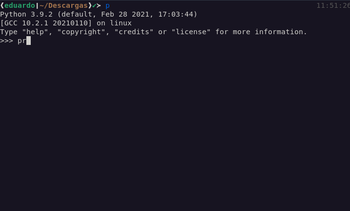

# Whetting Your Appetite

- There are some tasks that you'd like to automate. E.g.:

  - Rename and rearrange a bunch of photo files in a complicated/simple way.

    

  - Or search and replace over a large number of text files.

    

- Do not like write/compile/test/re-compile cycle.

  

  This can save us the precious little time we've got ;).

We can do all of these things with Python.

> [!TIP]
>
> Wanna learn coding in Python. You can go and read their standard modules. It can give you a very good sense of direction and how you should think when you develop an app.

> [!TIP]
>
> Whenever you got stuck somewhere go and chat with Generative AI tools. E.g. [ChatGPT](https://chatgpt.com/).

## Python REPL

Use it:

- To experiment with features of the language.
- To write throw-away programs.
- To test functions during bottom-up program development.
- As a handy desk calculator :|.


## The road ahead us

1. Simple expressions.
2. Statements and data types.
3. Functions and modules.
4. Exceptions and user-defined classes.

## Ref

- [https://docs.python.org/3/tutorial/appetite.html#whetting-your-appetite](https://docs.python.org/3/tutorial/appetite.html#whetting-your-appetite).

## YouTube/Aparat

- [https://aparat.com/v/xlw508e](https://aparat.com/v/xlw508e).
- [https://youtu.be/oQrnW7QbZNE](https://youtu.be/oQrnW7QbZNE).

## Invoking the Interpreter

- We talked about how to install Python [here](../01-intro/README.md#installing-python-interpreter).
- And we know how to run it thanks to our [first exposure to VSCode](../01-intro/README.md#ide----vscode).
- Exit from interpreter using end-of-file character:
  - `Ctrl + d` on Unix, `ctrl + z` on Windows.
  - Or just type `quit()`.
- In REPL we have:

  - Code completion.

    - On Windows you need to install `pyreadline3`: `python -m pip install pyreadline3` ([ref](https://stackoverflow.com/a/71186211/8784518)).

    

  - history substitution.

    

- Operates somewhat like the Unix shell:

  - Called with standard input connected to a tty device? It reads and executes commands interactively.

    

  - Called with a file name argument or with a file as standard input, it reads and executes a script from that file.

    

  - Use `-c` flag to tell python interpreter that it needs to run the specified code:

    

- Commands are read from a [tty](./glossary.md#teletypewritersDefinition).
- Primary prompt: `>>>`.
- Secondary prompt/Continuation lines: `...`.


- Python source files are treated as encoded in UTF-8 ([learn more about encoding](https://github.com/kasir-barati/html-css/blob/main/01-html/README.md#charset)).

  ```py
  # -*- coding: encoding -*-
  ```

  You can see a list of them [here](https://docs.python.org/3/library/codecs.html#standard-encodings).

## YouTube/Aparat

- [https://youtu.be/ltUwClOB60o](https://youtu.be/ltUwClOB60o).
- [https://aparat.com/v/oqzh038](https://aparat.com/v/oqzh038).

## Ref

- [https://docs.python.org/3/tutorial/interpreter.html](https://docs.python.org/3/tutorial/interpreter.html).

## How computer memory works

- Our memory defines us.
  - You're past exps.
  - Know-hows.
  - etc.
- Computers are the same in that regard.
- In computers everything takes the form of what is commonly referred to as **bits**.

### Bit

- Stands for **b**inary dig**it**.
  
- Can switch between 0 and 1.
- Every file/software consist of millions of these bits.
- Each one of them is stored in a [memory cell](./glossary.md#memoryCellDefinition).

### CPU -- Central Process Unit

- Computer's brain.
- Process bits.

  

- The amount of bits needs to be processed grows. Thus the need to always even in the modern era to optimize your software.

### Short-term memories

- Needs to be fast, thus we can access any place of the memory in any order.
- When we run a program CPU allocates memory to that program in short-term memory to run that program.
- E.g. When you open a movie it needs to process bits of data and tell your monitor what to do. In order to do that it needs to put your video's info somewhere withing reach and that somewhere is short-term memories.
- Used to store data just for a short period of time.
- Cut of the power supply (electricity) and your data is gone.
- Categories:
  - DRAM -- Dynamic Random Access Memory.
  - Cache -- Internal cache inside CPU made up from SRAM (Static RAM).

### Long term memories

- Most well know ones:

  - Optical base storages:
    - DVD -- Digital Versatile Disc.
    - CD -- Compact Disc.
  - HDD -- Hard Disk Driver.

    - Magnetic storage.

      

  - SSD -- Solid State Drive.
    - USB hard disk driver.

- Used to store data permanently.
- Turn off the computer and turn it back on the next day it still has the data.

### Memory latency

- The time it takes for the bits to be transferred from memory to CPU.

  

### Digital storage terminology


- Byte is 8 bits put together.
- The space necessary to store 1 character (letter/number/symbol).


- Kilobyte is 1000 bytes put together.
- Enough to store one third of a page.

> [!NOTE]
>
> Digital storage uses the binary system, thus everything needs to be in powers of two.


- 1000 Kilobytes.
- Roughly enough to store one book, one photo, or 1 minute of music.


- 1000 Megabyte.
- Enough for 1000 books.

## Ref

- [How computer memory works - Kanawat Senanan](https://youtu.be/p3q5zWCw8J4?si=th34ctRMV0u3Yrob).
- [Computer Skills Course: Bits, Bytes, Kilobytes, Megabytes, Gigabytes, Terabytes (UPDATED VERSION)](https://youtu.be/u4P0LOofEFs?si=bnNIyTUaRmWWvZQn).

## YouTube/Aparat

- [https://youtu.be/5UZ1w6zQIbo](https://youtu.be/5UZ1w6zQIbo).
- [https://aparat.com/v/ouphbs0](https://aparat.com/v/ouphbs0).

## Informal introduction

- To end a multi-line command in REPL press enter twice.
- Comments in Python:

  - Start with the hash character: `#`.
  - Extend to the end of the physical line.
  - Clarify code.
  - Ain't interpreted by Python interpreter.
  - Can be omitted.
  - Don'ts:

    - Cannot write comment within a string literal.

      

      A hash character within a string literal is just a hash character!

### Python as a Calculator

- Type an expression and it will evaluate it.
- Expression syntax:

  - The operators `+`, `-`, `*` and `/` can be used to perform arithmetic.
  - Parentheses (`()`) can be used for grouping.

  

### Numbers in Python

- Integer numbers:
  - Type: `int`.
  - E.g. `2`, `4`, `20`.
- Floating point numbers:
  - Type: `float`.
  - Have fractional part.
  - E.g. `5.0`, `1.6`.
- `Decimal` numbers.
  - Ideal for precise base-10 arithmetic.
  - E.g. in financial calculations, do not have errors like: `0.1 + 0.2 != 0.3`.
  - <details>
      <summary>Example in Python</summary>
      <pre lang="python">
        <code>
          from decimal import Decimal
          decimal1 = Decimal('0.1')
          decimal2 = Decimal('0.2')
          result = decimal1 + decimal2
          print(decimal1 + decimal2 == Decimal('0.3')) # True
          print(decimal1 + decimal2 == 0.3) # False
          print(0.1 + 0.3 == 0.3) # False
        </code>
      </pre>
      <p>
        Computers use binary (base-2) to represent numbers. Many decimal fractions (like <code>0.1</code> and <code>0.2</code>) cannot be represented exactly in binary. This results in small precision errors.
      </p>
      <pre lang="python"><code>print(0.1 + 0.2) # 0.30000000000000004</code></pre>
    </details>
- `Fraction` numbers.
  - Precise representation of fractions.
  - Exact rational arithmetic (e.g., `1/3` remains `1/3` instead of an imprecise float like `0.333...`).
  - <details>
      <summary>Example in Python</summary>
      <pre lang="python">
        <code>
          from fractions import Fraction
          fraction1 = Fraction(1, 3) # 1/3
          fraction2 = Fraction(2, 5) # 2/5
          result = fraction1 + fraction2 
          # Fraction addition: 1/3 + 2/5 = 11/15
          print(f"Fraction addition: {fraction1} + {fraction2} = {result}") 
        </code>
      </pre>
      <p>
        <code>f""</code> is what we call
        <a href="./glossary.md#fStringsDefinition">"f-strings"</a>.
      </p>
    </details>
- [Complex numbers](https://docs.python.org/3/library/stdtypes.html#typesnumeric):
  - A number that has both a real part and an imaginary part.
  - E.g. `3+4j`.

#### Operators

<table>
  <tr>
    <th>Name</th>
    <th>Plus/Addition</th>
    <th>Minus/Subtract</th>
    <th>Multiply</th>
    <th>Division</th>
    <th>Floor division</th>
    <th>Remainder/Dividend</th>
    <th>Power</th>
    <th>N/A</th>
  </tr>
  <tr>
    <th>Operator</th>
    <td>+</td>
    <td>-</td>
    <td>*</td>
    <td>/</td>
    <td>//</td>
    <td>%</td>
    <td>**</td>
    <td>Mixed</td>
  </tr>
  <tr>
    <th>Example</th>
    <td><code>7+3</code></td>
    <td><code>7-3</code></td>
    <td><code>7*3</code></td>
    <td><code>7/3</code></td>
    <td><code>7//3</code></td>
    <td><code>7%3</code></td>
    <td><code>7**3</code></td>
    <td><code>7*3.2+1</code></td>
  </tr>
  <tr>
    <th>Results</th>
    <td><code>10</code></td>
    <td><code>4</code></td>
    <td><code>21</code></td>
    <td><code>2.3333333333333335</code></td>
    <td><code>2</code></td>
    <td><code>1</code></td>
    <td><code>343</code></td>
    <td><code>23.400000000000002</code></td>
  </tr>
</table>

##### Operator precedence


Example:


---

### Variables

- Assign a value to a variable with `=`.
- Variable is not "defined" (assigned a value), trying to use it will give you an error.
  ```python
  >>> var_name
  Traceback (most recent call last):
    File "<stdin>", line 1, in <module>
  NameError: name 'var_name' is not defined
  ```
- A special variable named `_` (underscore).
  - It holds the result of previous expression.
  - ```python
    >>> tax = 12.5 / 100
    >>> price = 100.50
    >>> price * tax
    12.5625
    >>> price + _
    113.0625
    ```
  - Treat it as read-only.

---

### Strings in Python

- Manipulate text.
- Type: `str`.
- Enclosed in:

  - Single quotes: `'...'`.
  - Double quotes: `"..."`.

  > [!NOTE]
  >
  > To quote a quote:
  >
  > - "Escape" it, by preceding it with `\`: `'I\'m'`.
  > - Use the other type of quote: `"I'm"`.
  >
  > To escape `\` itself:
  >
  > - Add another `\` in front of it: `\\`.
  > - Use raw strings:
  >   ```python
  >   r'C:\Users\kasir-barati'
  >   r'I\'m called back slash & \ is my symbol'
  >   ```

- [Learn how to use `\` at the end of your string](https://docs.python.org/3/faq/programming.html#faq-programming-raw-string-backslash):
  ```python
  # This is invalid
  r"I am \"
  ```
- Use 3 quotation mark for multi line string:
  - E.g.: `"""Multiline string"""`
  - <table>
      <thead>
        <tr>
          <th>Have the initial newline</th>
          <th>Exclude the initial newline</th>
        </tr>
      </thead>
      <tr>
        <td><pre lang="python"><code>print("""
    Hi
    """)</code></pre></td>
        <td><pre lang="python"><code>print("""\
    Hi
    """)</code></pre></td>
      </tr>
    </table>
- Operators:

  - `*`:
    - Repeats it.
    - E.g.: `3 * "hi "`
  - `+`:
    - Concatenates.
    - E.g.: `"Mohammad " + 'Jawad'`.
      - Same as: `"Mohammad " 'Jawad'` (only works with two literals).
  - Mix them:
    - E.g.: `("-" * 5) + "I LOVE AI" + ("""-""" * 5)`
  - `[]`:

    - Subscript:
      - The first character's index is 0.
      - Negative indices: start counting from the right.
      - ```python
        word = 'Python'
        print(word[0])  # P
        print(word[-1])  # n
        ```
    - Slicing:
      ```python
      # [0, 2)
      # Returns 'Py'
      word[0:2]
      # Omitted first index defaults to zero
      # Returns 'Py'
      word[:2]
      # Omitted second index defaults to the size of the string being sliced
      # Returns 'on'
      word[4:] # word[-2:]
      # Returns 'Python'
      word[:2] + word[2:]
      # Out of range slicing:
      # Returns 'on'
      word[4:42]
      # Out of range slicing:
      # Returns ''
      word[42:]
      ```

    

    > [!CAUTION]
    >
    > ```python
    > >>> word[42]
    > Traceback (most recent call last):
    >   File "<stdin>", line 1, in <module>
    > IndexError: string index out of range
    > ```

- Immutable indices:
  ```python
  word[0] = 'K' # or word[2:] = 'char'
  Traceback (most recent call last):
    File "<stdin>", line 1, in <module>
  TypeError: 'str' object does not support item assignment
  ```
- `len` built-in function return length of a string: `len(word) # 6`.
- AKA ["text sequence type"](https://docs.python.org/3/library/stdtypes.html#text-sequence-type-str).

### Lists in Python

- A compound data type.
- Group together other values.
- The most versatile.
- A list of comma-separated values/items between square brackets.
- Can contain items of different types.
- `len` returns the length of the list.
- Can be indexed and sliced.
- Mutable indices.

```python
squares = [1, 4, 9, 16, 25]
squares[0] # 1
squares[-1] # 25
squares[-2:] # [16, 25]
squares.append(113) # [1, 4, 9, 16, 25, 111]
squares = squares + [36, 49] # [1, 4, 9, 16, 25, 111, 36, 49]
squares[-3] = -888 # [1, 4, 9, 16, 25, -888, 36, 49]
```

#### Shallow copy

```python
books = ["Freakonomics", "The Prince", "The Pragmatic Programmer"]

my_favorite_books = books

my_favorite_books.append("The Zero Marginal Cost Society")

print(books)
```

Any changes to one will be seen through all other variables that refer to the same list.

```python
books = [
  "Hands-On machine learning with Keras and Tensorflow",
  "Grokking Deep Learning"
]

# Here we are copying them
want_to_read = books[:]

want_to_read.append("Artificial Intelligence: A Guide for Thinking Humans")

print(books)
```

> [!TIP]
>
> To learn how to style your code which is widely adapted you can check [PEP 8 – Style Guide for Python Code](https://peps.python.org/pep-0008/).

#### Multi Dimensional lists

- 2D lists:

  

- 3D lists:

  

  ```python
  array_3d = [
      [  # Array 1
          [111, 112, 113],
          [121, 122, 123],
          [131, 132, 133],
      ],
      [  # Array 2
          [211, 212, 213],
          [221, 222, 223],
          [231, 232, 233],
      ],
      [  # Array 3
          [311, 312, 313],
          [321, 322, 323],
          [331, 332, 333],
      ],
  ]
  ```

### Our first real program in Python

I guess you know [Fibonacci series](https://en.wikipedia.org/wiki/Fibonacci_sequence).


Here is how you can code it in Python

```python
a, b = 0, 1
while a < 10:
    print(a)
    a, b = b, a+b
```

<details>
  <summary>Explanation of Python syntax used in this program</summary>
  <ul>
    <li>Multiple assignment.</li>
    <li>
      <code>while</code> loop.
      <br />
      <b>NOTE</b>: In Python any non-zero integer value is <code>true</code>. zero is <code>false</code>.
      <br />
      Comparison operators are:
      <ul>
        <li><code>&lt;</code> (less than).</li>
        <li><code>&gt;</code> (greater than).</li>
        <li><code>==</code> (equal to)</li>
        <li><code>&lt;=</code> (less than or equal to).</li>
        <li><code>&gt;=</code> (greater than or equal to).</li>
        <li><code>!=</code> (not equal to).</li>
      </ul>
    </li>
    <li><code>print()</code></li>
  </ul>
</details>

### Ref

[3. An Informal Introduction to Python](https://docs.python.org/3/tutorial/introduction.html).
