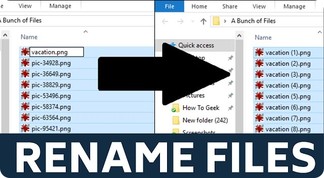

# Whetting Your Appetite

- There are some tasks that you'd like to automate. E.g.:

  - Rename and rearrange a bunch of photo files in a complicated/simple way.

    

  - Or search and replace over a large number of text files.

    

- Do not like write/compile/test/re-compile cycle.

  

  This can save us the precious little time we've got ;).

We can do all of these things with Python.

> [!TIP]
>
> Wanna learn coding in Python. You can go and read their standard modules. It can give you a very good sense of direction and how you should think when you develop an app.

> [!TIP]
>
> Whenever you got stuck somewhere go and chat with Generative AI tools. E.g. [ChatGPT](https://chatgpt.com/).

## Python REPL

Use it:

- To experiment with features of the language.
- To write throw-away programs.
- To test functions during bottom-up program development.
- As a handy desk calculator :|.

## The road ahead us

1. Simple expressions.
2. Statements and data types.
3. Functions and modules.
4. Exceptions and user-defined classes.

## Ref

- [https://docs.python.org/3/tutorial/appetite.html#whetting-your-appetite](https://docs.python.org/3/tutorial/appetite.html#whetting-your-appetite).

## YouTube/Aparat

- [https://aparat.com/v/xlw508e](https://aparat.com/v/xlw508e).
- [https://youtu.be/oQrnW7QbZNE](https://youtu.be/oQrnW7QbZNE).
