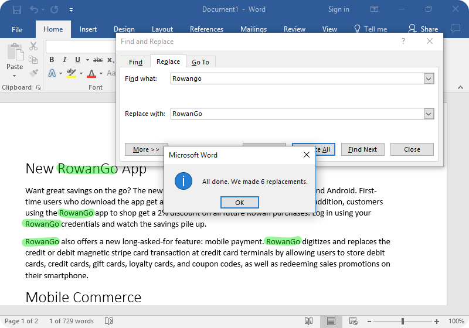

# Whetting Your Appetite

- There are some tasks that you'd like to automate. E.g.:

  - Rename and rearrange a bunch of photo files in a complicated/simple way.

    

  - Or search and replace over a large number of text files.

    

- Do not like write/compile/test/re-compile cycle.

  

  This can save us the precious little time we've got ;).

We can do all of these things with Python.

> [!TIP]
>
> Wanna learn coding in Python. You can go and read their standard modules. It can give you a very good sense of direction and how you should think when you develop an app.

> [!TIP]
>
> Whenever you got stuck somewhere go and chat with Generative AI tools. E.g. [ChatGPT](https://chatgpt.com/).

## Python REPL

Use it:

- To experiment with features of the language.
- To write throw-away programs.
- To test functions during bottom-up program development.
- As a handy desk calculator :|.


## The road ahead us

1. Simple expressions.
2. Statements and data types.
3. Functions and modules.
4. Exceptions and user-defined classes.

## Ref

- [https://docs.python.org/3/tutorial/appetite.html#whetting-your-appetite](https://docs.python.org/3/tutorial/appetite.html#whetting-your-appetite).

## YouTube/Aparat

- [https://aparat.com/v/xlw508e](https://aparat.com/v/xlw508e).
- [https://youtu.be/oQrnW7QbZNE](https://youtu.be/oQrnW7QbZNE).

## Invoking the Interpreter

- We talked about how to install Python [here](../01-intro/README.md#installing-python-interpreter).
- And we know how to run it thanks to our [first exposure to VSCode](../01-intro/README.md#ide----vscode).
- Exit from interpreter using end-of-file character:
  - `Ctrl + d` on Unix, `ctrl + z` on Windows.
  - Or just type `quit()`.
- In REPL we have:

  - Code completion.

    - On Windows you need to install `pyreadline3`: `python -m pip install pyreadline3` ([ref](https://stackoverflow.com/a/71186211/8784518)).

    

  - history substitution.

    

- Operates somewhat like the Unix shell:

  - Called with standard input connected to a tty device? It reads and executes commands interactively.

    

  - Called with a file name argument or with a file as standard input, it reads and executes a script from that file.

    

  - Use `-c` flag to tell python interpreter that it needs to run the specified code:

    

- Commands are read from a [tty](./glossary.md#teletypewritersDefinition).
- Primary prompt: `>>>`.
- Secondary prompt/Continuation lines: `...`.


- Python source files are treated as encoded in UTF-8 ([learn more about encoding](https://github.com/kasir-barati/html-css/blob/main/01-html/README.md#charset)).

  ```py
  # -*- coding: encoding -*-
  ```

  You can see a list of them [here](https://docs.python.org/3/library/codecs.html#standard-encodings).
