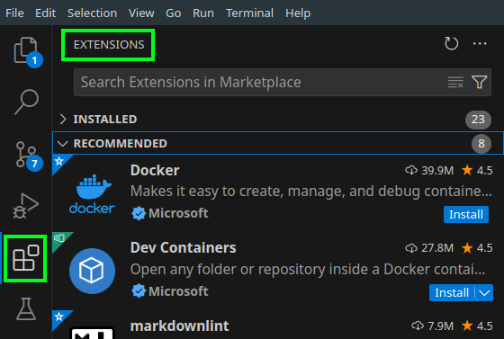
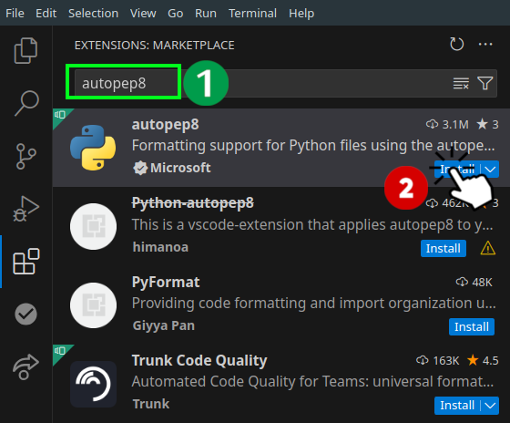
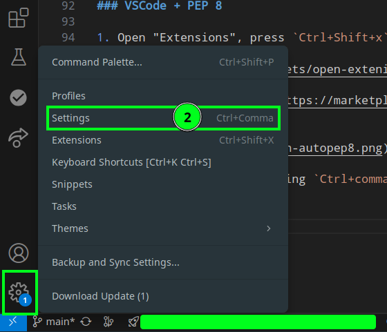
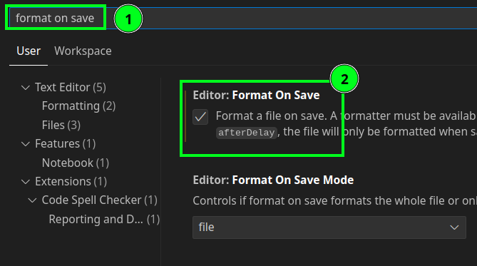
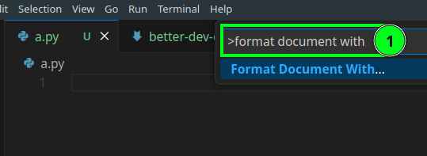
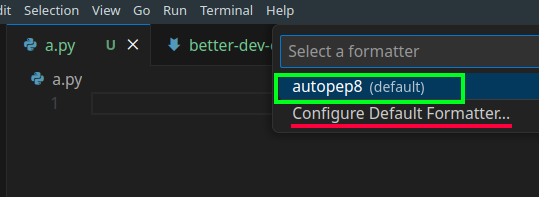
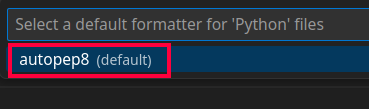
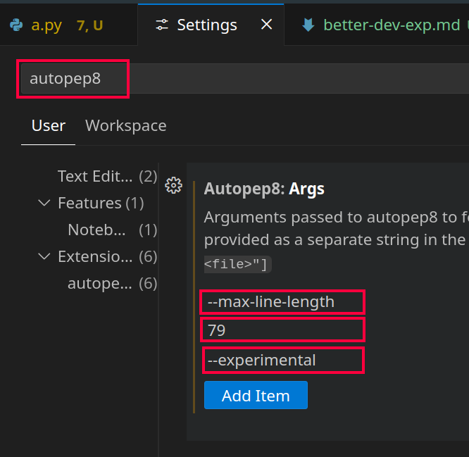

# Better dev exp

Here we will learn about function annotations, docstrings, and formatting styles.

## Function Annotation

- In Python 3 we can specify the type of our arguments and what our function returns.
- They're optional metadata info.
- The main idea was introduced in [PEP 3107](https://peps.python.org/pep-3107/) and [PEP 484](https://peps.python.org/pep-0484/). So be sure to read those PEPs thoroughly since type-safety of your code, and its maintainability depends on it IMO.

```python
def place_order(
        product_id : int,
        quantity : int,
        /,
        discount_code : str=None,
        *,
        shipping_address : str,
        expedited : bool=False) -> None:
    pass
```

## Docstring

- First line:
  - Always short.
  - Concise summary of the function's purpose.
  - Begin with a capital letter and end with a period.
- If it is multiline, second line should be blank.
- The 3rd line going forward you can write a description about your function. Things like:
  - Calling conventions.
  - Return value.
  - etc.

```python
def place_order(
        product_id : int,
        quantity : int,
        /,
        discount_code : str=None,
        *,
        shipping_address : str,
        expedited : bool=False) -> None:
    """
    Places an order for a product.

    Arguments:
    - product_id (int): ID of the product (positional-only)
    - quantity (int): Quantity to order (positional-only)
    - discount_code (str): Optional promo code (positional-or-keyword)
    - shipping_address (str): Required keyword-only address
    - expedited (bool): Optional, keyword-only flag for fast shipping
    """
    pass
```

> [!TIP]
>
> You can learn how to write good docstring by going through [PEP 0256](https://peps.python.org/pep-0256/), [PEP 0257](https://peps.python.org/pep-0257/) and [PEP 0258](https://peps.python.org/pep-0258/).

## Formatting Styles

- Making your code more readable is always a good idea, and adopting a nice coding style can help that tremendously.
- [PEP 8](https://peps.python.org/pep-0008/) is our style guide as I mentioned it from time to time.

### Most Important Points Extracted from PEP 8

- Use docstrings.
- Use 4-space indentation, no tabs.
- Wrap lines so that they do **NOT** exceed 79 characters.
- Write comments in a separate line whenever possible.
- Use blank lines to separate functions, classes, and larger blocks of code inside functions.
- Spaces:

  - After commas.
  - Around operators.

  ```python
  result = max(1, 2) + max(3, 4)
  ```

- Consistent function/class naming:

  - Class: `PascalCase`.
  - Methods/functions: `snake_case`.

  We talked about naming conventions [here](../01-intro/README.md#namingConventions).

- `self` as the name for the first method argument (will discuss it when we learned classes in Python).
- Try to use plain English and not fancy characters or some chars that needs a different encoding than utf-8 (we talked about encoding [here](./whetting-your-appetite-and-basic-concepts.md#pythonSourceFilesEncoding)).

### VSCode + PEP 8

1. Open "Extensions", press `Ctrl+Shift+x` or click on its icon on the left hand side panel:

   

2. Search for "[autopep8](https://marketplace.visualstudio.com/items?itemName=ms-python.autopep8)" and click on install button.

   

3. Open "Settings" by pressing `Ctrl+comma` or clicking on the gear icon on the bottom left corner of VSCode:

   

4. Then search for "Format On Save" and check it:

   

5. Configure autopep8 to be your default code formatter. To do that we need to open command palette by pressing `Ctrl+Shift+p` and type "format document with":

   

6. Press enter and autopep8 should be your default formatter.

   

   If not click on the "Configure Default Formatter":

   

7. And we need to configure it to not cross 79 line length define by PEP 8:

   

   [You can learn how to do it step by step here](https://stackoverflow.com/a/74370180/8784518).

8. After that you can install "Pylint" too to get nice suggestions to improve your code quality.

> [!CAUTION]
>
> This extension in my experience does not do a very good job. So be sure to read the PEP 8 just in case it was messing with your code.

## YouTube/Aparat

- [https://youtu.be/\_6kees89A-o](https://youtu.be/_6kees89A-o).
- [https://aparat.com/v/juno9oe](https://aparat.com/v/juno9oe).
