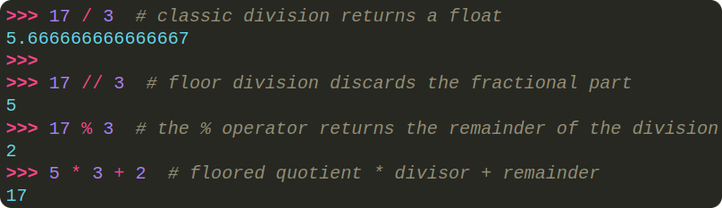

# Floored quotient

<code>floored quotient×divisor+remainder</code>

- The result of performing integer division where the quotient is rounded down (floored) to the nearest integer.
- This equation is a restatement of the division algorithm:

<code>dividend=quotient×divisor+remainder</code>

## Floored quotient

- `7÷3=2`
  - Floored quotient is `2`.
- `−7÷3=−3`
  - Floored quotient is `−3`
  - `−7÷3=−2.333...`, and rounding down gives `−3`.

## Divisor:

- The number by which the dividend is being divided.

## Remainder:

- The leftover value when the dividend is divided by the divisor.
- It satisfies this condition: `0≤ ∣remainder∣ < ∣divisor∣`.
  - `||` = absolute value.
