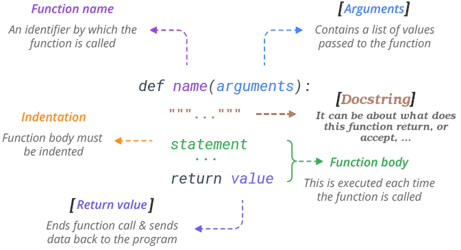
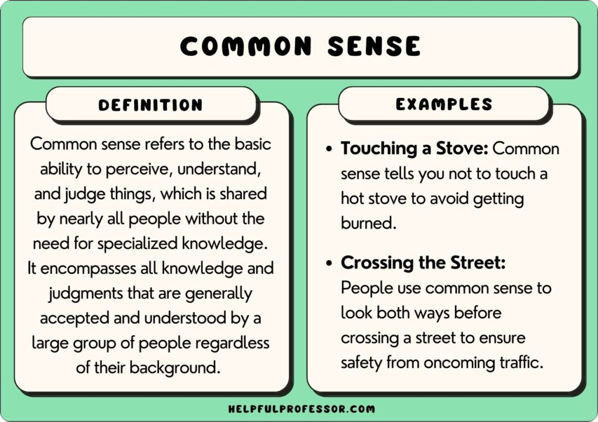
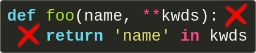
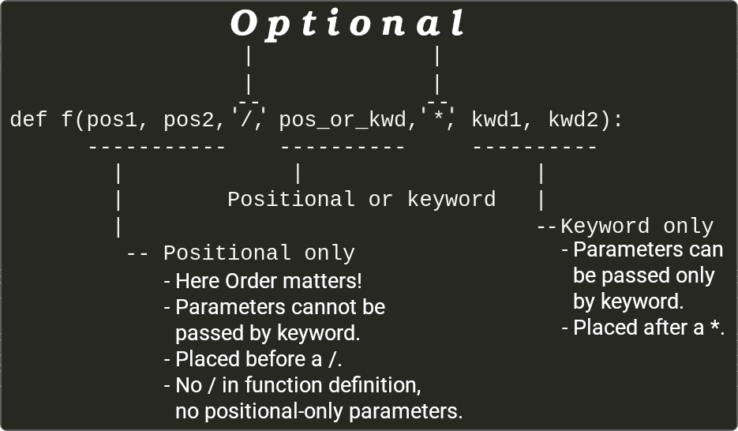

# Functions in Python

> [!NOTE]
>
> If you need a refresher about what is a function in general in programming take a look at [this](https://github.com/kasir-barati/html-css/blob/main/15-functions/README.md#function-notations-in-css).



- `def` introduces a function definition.
  - Give it a name.
  - Declare its arguments/inputs.
  - The body of the function start at the next line, and must be indented.
- `"""Print a Fibonacci series less than number."""` is a [docstring](./glossary.md#docstringDefinition).

  https://github.com/kasir-barati/python/blob/16dba0a784a9c587a2b1e01246ea1d5777802e56/02-getting-started/assets/fibonacci.py#L1-L10

- It is the same as every other value, i.e. other names can also point to that same function:

  ```python
  f = fib
  f(100)
  ```

- **Caution**: arguments are passed using:
  - [**Call by reference**](./glossary.md#callByReferenceDefinition) if they are a mutable object is passed.
  - [**Call by value**](./glossary.md#callByValueDefinition) if they are primitive types like string, integer, floating point, Decimal, etc.
- You can skip the `return`.

  - By default each function returns `None`.
  - Or return something:

    https://github.com/kasir-barati/python/blob/2888ad12d136918f367105f5323f869af2af8264/02-getting-started/assets/fibonacci.py#L12-L24

> [!NOTE]
>
> `.append()` is a _method_ of list object `result`.
> `.strip()` is a _method_ of string object [here](./most-common-statements.md#literals-vs-singletons).
> `.copy()` and `.items()` is a _method_ of dictionary object [here](./most-common-statements.md#for-statement).
>
> Method is:
>
> - A **function** that "belongs" to an object and is named `obj.method_name`.
> - `obj` can be of type list, string, etc.
>   - Different types define different methods. E.g. you do not have a `strip` method on a integer.
>
> Later when we start talking about classes you'll learn how to define your own object types and their methods :).

## Default Values for Args

```python
def calculate_salary(user, hour_rate=27):
    result = user["hours"] * hour_rate
    return result
user = { "hours": 15.2 }
salary = calculate_salary(user) # Or calculate_salary(user, hour_rate=29)
user["salary"] = salary
print(user)
```

- Here `hour_rate` is what we call an **optional argument**.

> [!TIP]
>
> Best practice: Do not mutate the passed arguments by reference. This practice is commonly know as **"avoiding side effects"** and instead returning the new result.
>
> Learn more about it [here](https://dev.to/mbarzeev/4-reasons-you-should-avoid-functions-side-effects-20ai) but I am gonna summarize it here in bullet points:
>
> 1. **Testability**: Your code's ability to be tested easily will drop significantly.
> 2. **Reusability**: You'll find it harder to not duplicated your code ([DRY principle](https://www.getdbt.com/blog/guide-to-dry)), but rather reuse it.
> 3. **Flexibility**: It'll be harder to change and adapt to new requirements.
> 4. **Readability**: Just imagine yourself going up and down to comprehend what a function does and how it fits into the bigger picture.

> [!CAUTION]
>
> The default value is evaluated only once. Why does this matter?
>
> | Buggy code                                                                                                                                       | Improved version                                                                                                                                   |
> | ------------------------------------------------------------------------------------------------------------------------------------------------ | -------------------------------------------------------------------------------------------------------------------------------------------------- |
> | https://github.com/kasir-barati/python/blob/ffb265fcbd407dc2873a2495b199ded3720c578e/02-getting-started/assets/default-value-evaluation.py#L1-L9 | https://github.com/kasir-barati/python/blob/ffb265fcbd407dc2873a2495b199ded3720c578e/02-getting-started/assets/default-value-evaluation.py#L11-L20 |
>
> <details>
>   <summary>Coalescing in python</summary>
>   <ul>
>     <li>
>       Here we are leveraging <a href="https://en.wikipedia.org/wiki/Short-circuit_evaluation">short-circuit evaluation</a> in logical expressions.
>     </li>
>     <li>
>       <pre lang="python"><code>user = user if user is not None else {}</code></pre>
>     </li>
>     <li>
>       A much longer version but more traditional and familiar to the eyes:
>       <pre lang="python"><code>
>       if user is None:
>           user = {}
>       </code></pre>
>     </li>
>   </ul>
> </details>

## `keyword_arg=value` / `kwarg=value`

- You can pass values to a function args by their names.

```python
def add_to_cart(
        product,
        cart,
        quantity=1,
        app="website"):
    print(f"{quantity} {product}s has been added to your cart #{cart}.")
    print(f"Thanks for using our {app} :)")
add_to_cart('apple', 12, 65498) # positional argument
add_to_cart('tomato', cart=321564) # 1 positional, 1 keyword
add_to_cart(quantity=4, cart=321564, product='tomato') # keyword argument

# INVALID invocations
add_to_cart() # missing required args
add_to_cart(discount=123) # unknown keyword argument
add_to_cart(cart=123987, 'Pineapple') # positional argument after a keyword argument
add_to_cart('apple', 65498, cart=65498) # TypeError: add_to_cart() got multiple values for argument 'cart'
```

> [!TIP]
>
> <a href="#useCommonSense" id="useCommonSense">#</a> Use common sense!
>
> 
>
> For example this function definition is wrong:
>
> 

BTW here we're following [PEP 8](https://peps.python.org/pep-0008/) for styling our code.

## Functions with Variable Number of Arguments

- AKA "variadic functions".

```python
def f1(a, b=False, **rest):
    print(a)
    print(b)
    print("-" * 20)
    for key, value in rest.items():
        print('\t', key, '\t: ', value)

# Wrong: f1(12,True, "hi", "fun", 123)
f1(12,True, greet="hi", r="fun", s=123)
f1(12, b=True, greet="hi", r="fun", s=123)
f1(12, greet="hi", r="fun", s=123)

print('/\\' * 20)
print(r'\/' * 20)

def greet(greet_message, *names):
    for name in names:
        print(greet_message, name)
        print("-" * 20)

# Wrong greet("こにちは", me="Mohammad Jawad", user={"name": "Hiroshi"}, pi=3.14)
greet("こにちは", "Mohammad san", "さくら", "Alex", "Hana", True)
```

- [_Variadic_ argument](https://en.wiktionary.org/wiki/variadic) comes last.
  - They scoop up all remaining input arguments that are passed to the function
  - `rest` is a `dict` in `f1`, and `names` is a tuple in `f2` (like what we were doing [here](./most-common-statements.md#unpackingDictionaryListTuple)).
  - Python guarantees the order of arguments passed to the function when it was called to be the same when we loop over it.
- **NOTE**: any formal parameters which come after the variadic arg will be a keyword-only arg.
  - Keyword-only args can only be passed like this: `kwarg=value`.

> [!TIP]
>
> We've seen how to unpack tuples, dictionaries, and lists in `match` case [here](./most-common-statements.md#unpackingDictionaryListTuple), now we'll learn how to unpack a `list`/tuple in Python. Then we can pass the unpacked values as arguments to a function:
>
> ```python
> greet_args = ["Moin", "Christoph", "ひなた", "Jawad", "ちなつ"]
> greet(*greet_args) # call with arguments unpacked from a list
> ```
>
> And for `dict` you can add two asterisks: `**`:
>
> ```python
> add_to_cart_args = {
>     "product": "Chopstick",
>     "quantity": 1,
>     "cart": 565676,
>     "app": "android-app"
> }
> add_to_cart(**add_to_cart_args)
> ```

## Dictates what your function accepts



- Specify whether your function accepts arguments passed by:

  - Positional-only.
  - Position-or-keyword.
  - Or keyword-only.

- This can restrict other devs who will call this function and yourself about how you should define arguments, but in return this convention will help you to:
  1. Organize your code better.
  2. Follow same pattern everywhere.
  3. You/other dev know what to expect.

```python
def place_order(
        product_id,
        quantity,
        /,
        discount_code=None,
        *,
        shipping_address,
        expedited=False):
    print(f"Order Details:\n - Product ID: {product_id}\n - Quantity: {quantity}")
    if discount_code:
        print(f" - Discount Code: {discount_code}")
    print(f" - Shipping Address: {shipping_address}")
    print(f" - Expedited Shipping: {'Yes' if expedited else 'No'}")

# Correct Calls:
place_order(101, 2, "SAVE20", shipping_address="123 Elm St")  # Discount applied
place_order(202, 5, shipping_address="456 Oak St", expedited=True)  # No discount

# Incorrect Calls (will raise TypeError):
# place_order(product_id=101, quantity=2, shipping_address="789 Pine St")  # product_id and quantity are positional-only
# place_order(101, 2, "SUMMER", "789 Pine St")  # shipping_address must be a keyword argument

def pos_only_arg(arg, /):
    print(arg)
def kwd_only_arg(*, arg):
    print(arg)
```

> [!TIP]
>
> Back to "[use common sense](#useCommonSense)" we can tweak the function definition a little to do what we want. So the problem there is that:
>
> 1. We have a collision between the positional argument `name` and `**kwds` which has `name` as a key.
> 2. Keyword `name` will always bind to the first parameter.
>
> ```python
> def foo(name, /, **kwds):
>     return 'name' in kwds
> ```
>
> So by using `/` we're declaring `name` as a positional argument and the second argument will be able to use `name` as a key for a dictionary without causing any ambiguity.

### Final Words -- a Guideline

- **Use positional-only** when:

  - Wanna hide the args names from the user:
    - The arg names does not have a real meaning.
  - Need to enforce the order of the arguments.
  - Developing an API. This prevents breaking API if the parameter's name is modified in the future.

- **Use keyword-only** when:

  - Names have meaning and the function definition is more understandable by being explicit with names
  - You wanna prevent users relying on the position of the argument being passed.

- You can have function that accept variable arguments (i.e. can accept any number of args).

## YouTube/Aparat

- [https://youtu.be/\_6kees89A-o](https://youtu.be/_6kees89A-o).
- [https://aparat.com/v/juno9oe](https://aparat.com/v/juno9oe).

## Ref

- ["Defining Functions" in "More Control Flow Tools"](https://docs.python.org/3/tutorial/controlflow.html#defining-functions).
