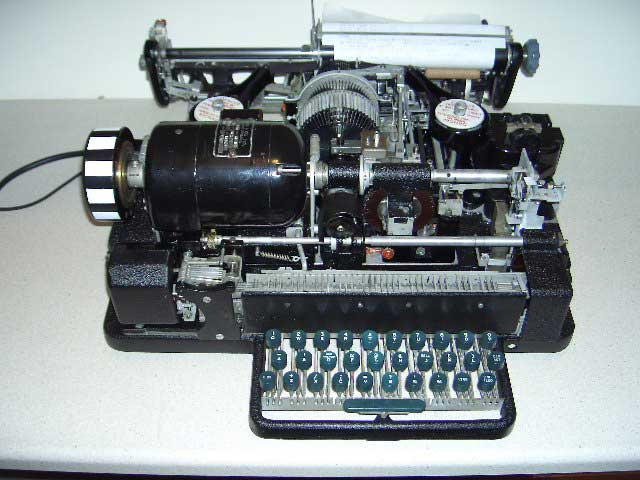

<dl>
  <dt id="teletypewritersDefinition">
    <a href="#teletypewritersDefinition">#</a>
    TTY
  </dt>
  <dd>
    Comes from electromechanical teleprinters or 
    <b>t</b>ele<b>ty</b>pewriters.
  </dd>
  <dd>
    
  </dd>
  <dd>
    <a href="https://askubuntu.com/a/481915/820307">
    Learn more
  </dd>
  <dt id="memoryCellDefinition">
    <a href="#memoryCellDefinition">#</a>
    Memory cell
  </dt>
  <dd>
    An <a href="https://commons.wikimedia.org/wiki/File:Electronic_circuit.jpg">electronic circuit</a>.
  </dd>
  <dd>Stores one bit of binary information.</dd>
  <dd>
    Stores a logic 1 (high voltage level) and reset to store a logic 0 (low voltage level).
  </dd>
  <dd>
    
  </dd>
  <dt id="fStringsDefinition">
    <a href="#fStringsDefinition">#</a>
    <i>f-strings</i>
  </dt>
  <dd>String literals that have embedded expressions.</dd>
  <dd>
    <pre lang="python">
      <code>
        name = "Fred"
        f"He said his name is {name}."
      </code>
    </pre>
  </dd>
  <dd>
    <a href="https://docs.python.org/3/reference/lexical_analysis.html#f-strings">Learn more here</a>.
  </dd>
</dl>
