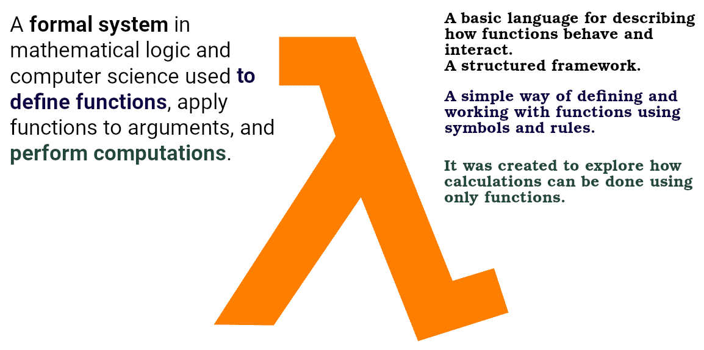
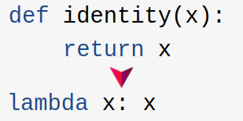

# Lambda Expressions


- Small anonymous functions.
- Can take any number of arguments, but can only have one expression.
- Aliases:
  - Function literals.
  - Anonymous functions (what we usually call them in JS).
  - Lambda form.
  - **Lambda functions (what we usually call them in Python)**.
  - Lambda expressions.
  - Lambda abstractions.

> [!NOTE]
>
> It is a concept borrowed from functional programming paradigm.
>
> - In Python lambdas are only a shorthand notation, if you’re too lazy to define a function ([ref](https://docs.python.org/3/faq/design.html#why-can-t-lambda-expressions-contain-statements)) you can use lambda function.
> - Keep in mind to **NOT** expect anything fancy from them.

## [Lambda Calculus](https://en.wikipedia.org/wiki/Lambda_calculus)

Lambda functions in Python and other programming languages originates from Lambda Calculus. Here is a formal definition of it + a breakdown:



## Syntax

- Created with the `lambda` keyword.
- Used wherever function objects are required.
- Syntactically restricted to a single **expression**.
- No statement is allowed inside it.
- Does **NOT** support type annotations.
- Just syntactic sugar for a normal function.
- Frequently used with higher-order functions.
  - It either:
    - Takes one or more functions as arguments.
    - Or returns one or more functions.
  - E.g. [`map()`, `filter()`](https://docs.python.org/3/library/functions.html), `functools.reduce()`, etc:
    ```python
    fruits = ['pineapple', 'banana', 'cherry']
    res = list(map(str.upper, fruits))
    print(res)
    ```

```python
lambda arguments : expression
```

## Examples

```python
def make_incrementor(n):
    return lambda x: x + n
temp = make_incrementor(13) # temp = lambda x: x + 13
print(temp(1)) # lambda 1: 1 + 13 => 14

x = lambda a, b, c: a + b + c
print(x(1, 2, 3)) # lambda 1, 2, 3: 1 + 2 + 3

full_name = lambda first, last: f'{first.strip().capitalize()} {last.strip().title()}'
full_name(' alen ', ' kim ') # Alen Kim

list1 = [1, 2, 3]
list2 = [4, 5, 6]
sum_of_list1_and_list2_elements = list(map(lambda x, y: x + y, list1, list2))
print(sum_of_list1_and_list2_elements)
```

### Normal Function to Lambda Function



## Immediately Invoked Function Expression

- Abbreviated to IIFE.
- ```python
  (lambda x, y: x + y)(2, 3)
  ```
- Cannot see any practical use case though.

## Debugging

- In the context of the lambda function, Python will not provide the name of the function, but only `<lambda>`.
- So if an exception occurs, traceback will only shows `<lambda>`.

<table>
  <thead>
    <tr>
      <th>Lambda version</th>
      <th>Normal Functions</th>
    </tr>
  </thead>
  <tbody>
    <tr>
      <td>
<pre lang="python">
<code>
div_zero = lambda x: x / 0
div_zero(2)
Traceback (most recent call last):
    File "<stdin>", line 1, in <module>
    File "<stdin>", line 1, in <lambda>
ZeroDivisionError: division by zero
</code>
</pre>
      </td>
      <td>
<pre lang="python">
<code>
def div_zero(x): return x / 0
div_zero(2)
Traceback (most recent call last):
    File "<stdin>", line 1, in <module>
    File "<stdin>", line 1, in div_zero
ZeroDivisionError: division by zero
</code>
</pre>
      </td>
    <tr>
  </tbody>
</table>

## YouTube/Aparat

- [https://youtu.be/QRhJhlMGc8A](https://youtu.be/QRhJhlMGc8A).
- [https://aparat.com/v/non5704](https://aparat.com/v/non5704).

## Learn more

- [How to Use Python Lambda Functions](https://realpython.com/python-lambda/).
