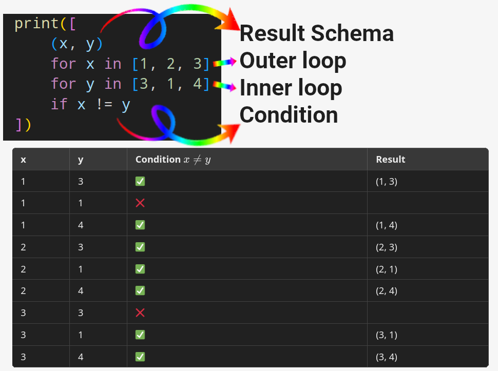
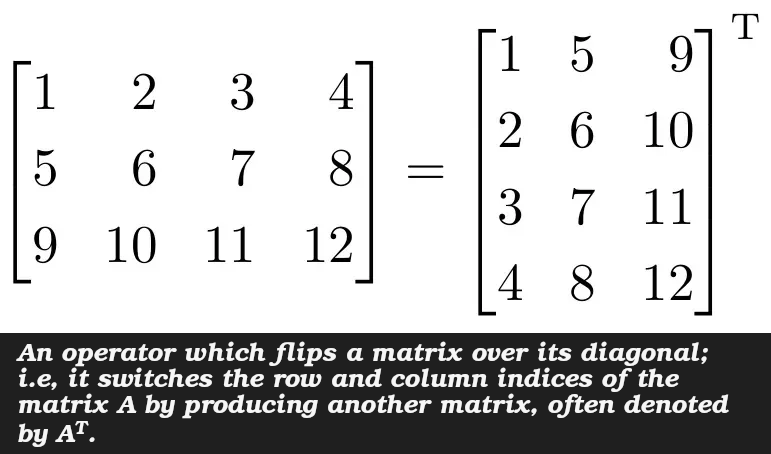
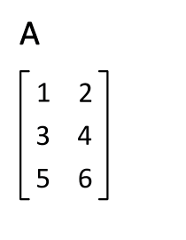

# List Data Type in Depth

- We've touched data structure topic already several times ([here](./whetting-your-appetite-and-basic-concepts.md#strings-in-python), [here](./most-common-statements.md#dictionary-in-python), and [here](./whetting-your-appetite-and-basic-concepts.md#numbers-in-python) for example).
- We've talked about lists [here](./whetting-your-appetite-and-basic-concepts.md#lists-in-python) too.
- And here we'll go into depth.

## Lists Methods

### `append(x)`

Adds an item to the end of the list.

<table>
  <thead>
    <tr>
      <th>`append`</th>
      <th>Alternative</th>
    </tr>
  </thead>
  <tbody>
    <tr>
      <td>
<pre lang="python">
<code>
martial_arts = ["Muay Thai"]
martial_arts.append("Karate")
</code>
</pre>
      </td>
      <td>
<pre lang="python">
<code>
martial_arts[len(martial_arts):] = ["Karate"]
</code>
</pre>
      </td>
    <tr>
  </tbody>
</table>

### `extend(iterable)`

Extend the list by appending all the items from the iterable.

<table>
  <thead>
    <tr>
      <th>`extend`</th>
      <th>Alternative</th>
    </tr>
  </thead>
  <tbody>
    <tr>
      <td>
<pre lang="python">
<code>
from typing import List
nums: List[int] = []
nums.extend(range(1, 5))
</code>
</pre>
      </td>
      <td>
<pre lang="python">
<code>
nums[len(nums):] = range(1, 4)
</code>
</pre>
      </td>
    <tr>
  </tbody>
</table>

### `insert(i, x)`

Insert an item at a given position.

<table>
  <thead>
    <tr>
      <th>`insert`</th>
      <th>Alternative</th>
    </tr>
  </thead>
  <tbody>
    <tr>
      <td>
<pre lang="python">
<code>
languages = ["English"]
languages.insert(0, "にほんご")
</code>
</pre>
      </td>
      <td>
<pre lang="python">
<code>
languages = ["にほんご"] + languages
languages = ["にほんご", *languages]
</code>
</pre>
      </td>
    <tr>
  </tbody>
</table>

### `remove(x)`

Remove the first item from the list whose value is equal to 3. Raises a [`ValueError`](https://docs.python.org/3/library/exceptions.html#ValueError) if it could not find a match.

<table>
  <thead>
    <tr>
      <th>`remove`</th>
      <th>Alternative</th>
    </tr>
  </thead>
  <tbody>
    <tr>
      <td>
<pre lang="python">
<code>
nums = [3, 2, 2, 0, 3]
nums.remove(3)
</code>
</pre>
      </td>
      <td>
<pre lang="python">
<code>
nums = [3, 2, 2, 0, 3]
nums = [x for x in nums if x != 3]
</code>
</pre>
      </td>
    <tr>
  </tbody>
</table>

### `pop([i])`

- Remove the item at the given position in the list.
- It returns the removed item.
- Call it with no index, it'll remove the last item in the list.
- An [`IndexError`](https://docs.python.org/3/library/exceptions.html#IndexError) will be raised if the list is empty or the index is outside the list range.
  - Bound checking: checks if an index is within valid bounds before accessing a list.
  - A feature of memory-safe languages.

```python
todo_list = ["buy groceries", "practice programming", "pay the bills", "exercise python"]
todo_list.pop(2)
```

### `clear()`

Delete everything inside a list.

<table>
  <thead>
    <tr>
      <th>`clear`</th>
      <th>Alternative</th>
    </tr>
  </thead>
  <tbody>
    <tr>
      <td>
<pre lang="python">
<code>
temp = list(range(1, 5))
temp.clear()
</code>
</pre>
      </td>
      <td>
<pre lang="python">
<code>
del temp[:]
</code>
</pre>
      </td>
    <tr>
  </tbody>
</table>

### `index(x[, start[, end]])`

- Finds the first item in the list that its value matches the passed arguments.
- Limit the search with `start` & `end`; they're interpreted as in the slice notation.
  - The returned index is computed relative to the beginning of the full sequence rather than the `start` argument.
- If it fails to find the specified value it will throw [`ValueError`](https://docs.python.org/3/library/exceptions.html#ValueError).

```python
fruits = ['orange', 'apple', 'pear', 'banana', 'tomato', 'kiwi', 'apple', 'banana']
fruits.index('banana') # 3
fruits.index('banana', 4) # 7
fruits.index('onion')
```

> [!TIP]
>
> Try to write a function with the same functionality, it:
>
> - Accepts two argument: `arr`, and `searched_value`.
> - Returns the index of where it found the first occurrence.
> - Then add the two **optional keyword-only** arguments for `start` and `end` + their functionality.
> - **Note**: You do not need to raise an exception when it failed to find it. Just print "Searched value does not exists!"

### `count(x)`

Counts how many times the searched value is repeated in the list.

```python
message = "Lorem ipsum dolor sit amet consectetur adipisicing elit. Ducimus omnis, dolorem eaque voluptate corporis dolor, non error vitae obcaecati nemo dolor nisi quasi architecto. Molestiae distinctio omnis ex dolor impedit!"
words = message.split(" ")
print(words.count("dolor")) # 3, but why?
```

### `sort(key=None, reverse=False)`

- Sorts an array **in place**.
- Can sort descending, e.g. `[1, 3, -34, 8, 2].sort(reverse=True)`.
- <details>
    <summary>
      You can dictate your own rule on how to sort by using `key` argument
    </summary>
    <p>
      Here we are checking when the first letter is uppercase, and if it was, then our function returns true, otherwise naturally it'll be false. And since <a href="https://docs.python.org/3/c-api/bool.html">booleans in Python are implemented as a subclass of integers</a> we get the cities with the first letter lowercase first and then capitalized cities.
    </p>
    <pre lang="python">
      <code>
        cities = ["Tokyo", "hong Kong", "Berlin", "moscow", "Singapore"]
        cities.sort(key=lambda x: x[0].isupper())
        print(cities)
      </code>
    </pre>
    <p>
      We can pass the <code>len</code> function as key, the strings are sorted based on their length.
    </p>
    <pre lang="python">
      <code>
        cities = ["Tokyo", "hong Kong", "Berlin", "moscow", "Singapore"]
        cities.sort(key=len)
        print(cities)
      </code>
    </pre>
  </details>
- Cannot sort a list with elements from different types that ain't castable to each other. I.e. because **they do not have a defined ordering relation**.

```python
timestamps = [1678886400,
              1700000000,
              1695432100,
              1682345678,
              1701234567,
              1699876543,
              1685678901,
              1702468024,
              1697531864,
              1689012345]
print(timestamps)
timestamps.sort()
print(timestamps)
```

### `reverse()`

Reverse the order of elements **in place**.

```python
support_tickets = ["Ticket 1: Password Reset",
                   "Ticket 2: Account Locked", "Ticket 3: Payment Issue"]
support_tickets.reverse()
```

### `copy()`

Return a shallow copy of the list.

<table>
  <thead>
    <tr>
      <th>copy</th>
      <th>Alternative</th>
    </tr>
  </thead>
  <tbody>
    <tr>
      <td>
<pre lang="python">
<code>
names = ["Mohammad", "ふじつ", "つづき"]
temp = names.copy()
</code>
</pre>
      </td>
      <td>
<pre lang="python">
<code>
temp = names[:]
</code>
</pre>
      </td>
    <tr>
  </tbody>
</table>

## Lists as Stacks

Easy to implement **LIFO** with lists in Python:

- Last element added is the first element retrieved ("last-in, first-out").
- Thanks to the methods we've seen [here](#lists-methods).

```python
visited_pages_url = [
    "example.com", "example.com/about-us", "instagram.com/example",
    "https://www.instagram.com/p/ASD83SDvoIQ/"]
visited_pages_url.append("huawei.com")
previous_page = visited_pages_url.pop()
```

## Lists as Queues

Can implement **FIFO** with lists in Python:

- First element added is the first element retrieved (“first-in, first-out”).
- **Caution**: lists ain't efficient for this purpose.
  - <details>
      <summary>Queues implementation with lists</summary>
      <pre lang="python">
        <code>
        print_documents = ["filename.pdf", "file2.pdf"]
        print_documents.append("another-file.pdf")
        first_document = print_documents.pop(0)
        </code>
      </pre>
    </details>
- A finer approach would be to use `collections.deque` because of its speed when inserting or getting data from both ends.

  ```python
  from typing import List
  from collections import deque


  def process_fifo(messages: List[str]) -> None:
      """Explore the passed dictionary for the target room"""
      # Queue to store all messages
      queue = deque(messages)

      while queue:
          current_message = queue.popleft()
          print(f"Processing message: {current_message}")

      print("All messages are processed!")

  process_fifo(["Message #1",
                "Message #2",
                "Message #3",
                "Message #4",
                "Message #5"])
  ```

## List Comprehensions

- A concise way to create lists.
- Easier.
- Syntax:
  1. Brackets.
  2. An expression inside that brackets.
     - Note: if the expression is a tuple, then it **must** be parenthesized.
  3. After the expression we have a `for` clause.
  4. Finally zero/more `for` or `if` clauses.

<table>
  <thead>
    <tr>
      <th>Normal way</th>
      <th>List comprehension way</th>
    </tr>
  </thead>
  <tbody>
    <tr>
      <td>
<pre lang="python">
<code>
from typing import List
numbers = [1, 2, 3, 4]
squares: List[int] = []
for n in numbers:
    squares.append(n ** 2)
print(squares)
</code>
</pre>
      </td>
      <td>
<pre lang="python">
<code>
numbers = [1, 2, 3, 4]
squares = [n ** 2 for n in numbers]
print(squares)
</code>
</pre>
Or make it a bit more cranky
<pre lang="python">
<code>
squares = list(map(lambda n: n ** 2, numbers))
</code>
</pre>
      </td>
    <tr>
    <tr>
      <td>
<pre lang="python">
<code>
from typing import List
def get_evens(nums: List[int]) -> List[int]:
    """Find all even numbers in the passed list."""
    result: List[int] = []
    for n in nums:
        if n % 2 == 0:
            result.append(n)
    return result
even_numbers = get_evens([1, 2, 3, 4])
print(even_numbers)
</code>
</pre>
      </td>
      <td>
<pre lang="python">
<code>
result = [n for n in nums if n % 2 == 0]
return result
</code>
</pre>
      </td>
    <tr>
    <tr>
      <td>
<pre lang="python">
<code>
combs = []
for x in [1, 2, 3]:
    for y in [3, 1, 4]:
        if x != y:
            combs.append((x, y))
</code>
</pre>
      </td>
      <td>
        
      </td>
    <tr>
  </tbody>
</table>

> [!TIP]
>
> Flatten a 2D-array:
>
> ```python
> vec = [[1, 2, 3], [4, 5, 6], [7, 8, 9]]
> [num for elem in vec for num in elem]
> ```
>
> Or sanitize your data:
>
> ```python
> groceries = ['  banana', ' chicken \t', '  loganberry ', 'passion fruit  ']
> sanitized_groceries = [grocery.strip() for grocery in groceries]
> ```

> [!NOTE]
>
> You can make your expression as complex as you desire it to be, but please keep it readable :wink:.
>
> ```python
> from math import pi
> pi_with_varying_precisions = [str(round(pi, i)) for i in range(1, 6)]
> ```

### Nested List Comprehensions

- The initial expression in a list comprehension can be any arbitrary expression.

<table>
  <thead>
    <tr>
      <th>Normal way</th>
      <th>Nested list comprehensions way</th>
    </tr>
  </thead>
  <tbody>
    <tr>
      <td>
<pre lang="python">
<code>
from typing import List
matrix = [
    [1, 2, 3, 4],
    [5, 6, 7, 8],
    [9, 10, 11, 12],
]
transposed: List[List[int]] = []
for i in range(4):
    transposed.append([row[i] for row in matrix])
</code>
</pre>
Or
<pre lang="python">
<code>
from typing import List
matrix = [
    [1, 2, 3, 4],
    [5, 6, 7, 8],
    [9, 10, 11, 12],
]
transposed: List[List[int]] = []
for i in range(4):
    transposed_row = []
    for row in matrix:
        transposed_row.append(row[i])
    transposed.append(transposed_row)
</code>
</pre>
      </td>
      <td>
<pre lang="python">
<code>
matrix = [
    [1, 2, 3, 4],
    [5, 6, 7, 8],
    [9, 10, 11, 12],
]
transposed = [
    [row[i] for row in matrix] # This inner list comprehension is evaluated in the context of the for that follows it
    for i in range(4)  # 4 is how many element we have in each row
]
</code>
</pre>
      
      <br/>
      
      </td>
    <tr>
  </tbody>
</table>

> [!TIP]
>
> In the real world, you **should** prefer [built-in functions](https://docs.python.org/3/library/functions.html) to complex flow statements. E.g. here we could just use `zip()` function:
>
> ```python
> list(zip(*matrix))
> ```

### The `del` Statement in Lists

- Remove an item from a list given its index.
- Different from the `pop()` method since it does not return the removed value.
- Can remove slices from a list.

```python
temp = list(range(1, 10))
del temp[0]
del temp[3:5]
del temp[:]
```

> [!CAUTION]
>
> `del temp` will delete the entire variable. So it is totally different from `del temp[:]` which just clear the list.

## Ref

- [5. Data Structures](https://docs.python.org/3/tutorial/datastructures.html).
