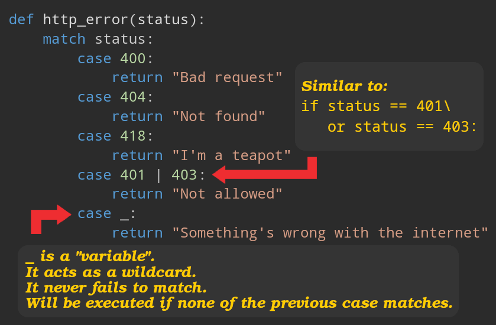

# Introductory

- Here we learn about some control flow tools, things like `while`, `if`, etc.
- PEP stands for: Python Enhancement Proposal

  <details>
    <summary>Lean more about <code>PEP</code></summary>
    <ul>
      <li>A design document.</li>
      <li>Describes new features or changes in Python.</li>
      <li>
        Features that formally are proposed, discussed, and approved by the Python community before being implemented.
      </li>
    </ul>
  </details>

## `if` Statement

- [Conditional expressions (PEP 308)](https://peps.python.org/pep-0308/).
- The most well-known statement type.

```python
age = int(input("Please enter you age: "))
# `if ... elif ... elif ... else` sequence:
if age < 0:
    age = 0
    print("Entered age is negative! You cannot be aged negatively, we changed it to zero")
elif age == 0:
    print("Entered age is zero! Are you sure?")
elif age > 0 and age < 30:
    print("You have not entered your middle age era.")
else:
    print("Get ready, you're now 30 or over 30.")
```

- There can be zero or more `elif` parts.
  - "else if".
- The `else` part is optional.
- A substitute for the `switch` or `case` statements.

> [!TIP]
>
> Truth Table:
>
> - `T` stands for "true".
> - `F` stands for "false".
> - `&&` equivalent in Python is `and`.
> - `||` equivalent in Python is `or`.
>
> 

### Literals VS Singletons

- Literal: things like integers, floats, strings, lists, etc.
- Singleton: `False`, `True`, and `None`.
- In python you need to use `is` for singletons rather than your normal `==` for equality check:

  ```python
  user_age = input("enter your age: ")
  if len(user_age.strip()) == 0:
      user_age = None
  else:
      user_age = int(user_age)

  if user_age is None:
      print("Invalid age!")
  elif user_age > 18:
      legal_age = True
  else:
      legal_age = False

  if legal_age is True:
      print("You'r old enough to drive a car, let's get your license!")
  ```

## Dictionary in Python

- Built-in data type.
  - Part of Python from the beginning and were not introduced through a PEP.
- AKA objects.

  

- Think of it as storing a group od related data with a label for each data.

## `for` Statement

- Iterates over the items of any sequence (e.g. [strings](./whetting-your-appetite-and-basic-concepts.md#strings-in-python), or [lists](./whetting-your-appetite-and-basic-concepts.md#lists-in-python)).
- Iterates in the order items appear in the sequence, e.g.

  ```python
  scores = [12, 43, 23]
  for score in scores:
      print(score)
  ```

- We can loop over collections too:

  ```python
  # Strategy:  Iterate over a copy
  user = {
      "username": '景太郎',
      "status": "active",
      'age': 25,
      'balance': 123.987,
      'student': False
  }
  for key, value in user.copy().items():
      if key == 'balance' and value < 0:
          user['status'] = 'deactivated'
      print(key + ' : ' + value)
  # Strategy: Create a new collection
  scores = {
    "math": 56,
    'physics': 100,
    'geography': 81,
    'statistics': 79,
    'computer': 34,
  }
  failed_subjects = {}
  for subject, score in scores.items():
      if score < 60:
          failed_subjects[subject] = score
  ```

  Code that modifies a collection while iterating over that same collection can be tricky to get right. Thus we usually tend to loop over a copy of the collection or to create a new collection

> [!NOTE]
>
> These [`user.copy()...`](https://www.geeksforgeeks.org/copy-python-deep-copy-shallow-copy/)/[`scores.items()`](https://www.w3schools.com/python/ref_dictionary_items.asp) are the built-in libraries and modules that we mentioned [here](../01-intro/README.md#extensiveBuiltinLibrariesInPython).

### `range` Function

- Wanna iterate over a sequence of numbers?
- Generates [arithmetic progressions](./glossary.md#arithmeticProgressionsDefinition).
- One of the many [built-in functions in Python](https://docs.python.org/3/library/functions.html).

  ```python
  # [0, 5)
  for i in range(5):
      print(i)
  ```

- Specify "step", keep in mind that `range` also can work with negative numbers:

  ```python
  list(range(5, 10)) # [5, 6, 7, 8, 9]
  list(range(0, 10, 3)) # [0, 3, 6, 9]
  list(range(-10, -100, -30)) # [-10, -40, -70]
  ```


- Iterate over the indices of a sequence like this:

  ```python
  names  = ['Maria', 'Mohammad', 'Jin', 'Hinata', 'Altan']
  for i in range(len(names)):
      print(i, names[i])
  ```

  `i` here stands for "index".

  > [!TIP]
  >
  > Read [this doc](https://docs.python.org/3/tutorial/datastructures.html#tut-loopidioms) to learn more about better ways of looping over a list.

> [!NOTE]
>
> - It doesn’t really make the list, thus saving space (`print(range(10))`).
> - Its return type is an _iterable object_.
>
>   - Some functions/constructs expect something, from which they can obtain successive items until the supply is exhausted.
>   - E.g. `for` statement, or `sum` function
>
>     

### `break` & `continue` Statements

- `break`: breaks out of the innermost enclosing `for` or `while` loop.
- `continue`: continues with the next iteration of the loop.

```python
ads = [
  { 'title': "CodeRabbit", 'category': 'ai' },
  { 'title': 'Netflix', 'category': 'entertainment' },
  { 'title': 'Audible', 'category': 'audio-book' },
]
for ad in ads:
    if ad['category'] == 'entertainment':
        continue
    print("Personalized ad: ", ad['title'])
for week in range(52):
    print('Week #' + str(week + 1))
    for work_day in range(7):
        if work_day > 4:
            print("Hooray, its weekend!")
            break
        print('Day #' + str(work_day + 1))
```

> [!TIP]
>
> When to use `break`/`continue`: [Stackoverflow Q&A](https://stackoverflow.com/a/3926229/8784518).

#### `else` Clause in a `for`/`while` Loop

- `for`/`while` statements can be paired with an `else` clause.
- Will be executed if the loop finishes **without** being terminated by a:
  - `break` statement.
  - `return` statement.
  - Raised exceptions.


## `pass` Statement

- Does nothing.
- Used when you're developing something and just wanna lay the foundation for later.

```python
class Polygon:
    pass # A polygon class with xyz helper func
def initlog(*args):
    pass # Remember to implement this!
```

## Tuple

- Built-in data type.
- Store multiple items in a single variable.
- Similar to collections but without a label for each value.
- written with round brackets (AKA parenthesis).
- Characteristics:
  - Ordered -- i.e. items have a defined order.
  - Indexed -- i.e. `[0]` returns the first value, and so on and so forth.
  - Unchangeable -- after we've created them they are readonly.
  - Allow duplicate values.
  - Can contain different data types at once.

```python
single_tuple = ('Google',) # Note that the trailing comma is necessary
coordinates = (34.66688492670634, 133.9371036903121)
print('Latitude: ', coordinates[0])
print('Longitude: ', coordinates[1])
```

> [!TIP]
>
> We can pack and unpack lists and tuples in Python:
>
> 

## `match` Statement

- Commonly know as structural pattern matching ([PEP 634](https://peps.python.org/pep-0634/)).
- Compares an expression's value to successive patterns.
- AKA `switch` statement in C-family programming languages.

```python
# LLM stands for Large Language Model
llm = input("Please enter your LLM: ")
match llm:
    case "claude":
        print("Claude is a family of large language models developed by Anthropic.")
    case "gpt4":
        print("Generative Pre-trained Transformer 4 is a multimodal large language model created by OpenAI")
    case "gp3":
        print("Generative Pre-trained Transformer 3 is a large language model released by OpenAI in 2020.")
    case "gemini":
        print("Gemini, formerly known as Bard, is a generative artificial intelligence chatbot developed by Google.")
```

Or it can be a bit more sophisticated:



We can use tuples in a `match` statement too, here you can see how we:

- Unpack a tuple.
- Define a captured variable (e.g. `y` in the second `case`).

```python
point = (1, 3)
match point:
    case (0, 0):
        print("Origin")
    case (0, y):
        print(f"Y={y}")
    case (x, 0):
        print(f"X={x}")
    case (x, y): # Similar to unpacking assignment: (x, y) = point
        print(f"X={x}, Y={y}")
    case _:
        raise ValueError("Not a point")
```

Or you can opt for matching against lists:

https://github.com/kasir-barati/python/blob/80b305428801a3517eec3e038987e1ed065cd742/02-getting-started/assets/match-a-list-of-points.py#L1-L27

> [!TIP]
>
> - Unpacking a list in a match statement
>
>   ```python
>   value = [1, 2, 4]
>   match value:
>       # Matches a list with at least 2 elements
>       case [a, b, *rest]:
>           print(f"First two: {a}, {b}, rest: {rest}")
>   ```
>
> - Unpacking a dictionary in a match statement:
>
>   ```python
>   user = {
>     "name": "Mohammad Jawad san",
>     "age": "30",
>     "hobby": "Programming",
>     "job": "Solving tough problems through computer science"
>   }
>   match user:
>       case {"job": job, "age": age, **rest}:
>           print(job, age)
>           print(rest)
>   ```

### [Guard in `match` Statement](https://docs.python.org/3/reference/compound_stmts.html#guards)

- Added `if` clause to a pattern.
- Is the guard `False`? if yes then continue with the next `case` block.

```python
event = input("Is today a holiday or a workday? ")
is_seek = True
match event:
    case "holiday" if is_seek == True:
        print("You've got the entire holiday to rest. Get well soon :)")
    case "holiday":
        print("Let's go out and have fun :)")
    case "workday":
        print("let's go to work :)")
    case _:
        print('It is neither "holiday" nor "workday"')
```

### Access Unpacked Subsequence

```python
coordinates = [
    [53.0793, 8.8017],
    [35.6762, 139.6503]
]
match coordinates:
    # No difference with:
    #   case [bremen, tokyo]:
    #   case [(_, _) as bremen, (_, _) as tokyo]:
    #   case [[x1, y1] as bremen, [x2, y2] as tokyo]:
    case [(_, _), (x2, y2) as tokyo]:
        print(f"Tokyo's latitude and longitude are {tokyo} respectively")
```

- `_`:
  - A wildcard
  - Ignores the specific values of the elements in the lists.
  - You do **NOT** care about the exact value in that position.
  - Not accessible (it is not a variable).

> [!TIP]
>
> To learn more read **[PEP 636](https://peps.python.org/pep-0636/)** which is interestingly **written in tutorial format**.

---

## Ref

- [From "More Control Flow Tools" up to "Defining Functions"](https://docs.python.org/3/tutorial/controlflow.html)

---
