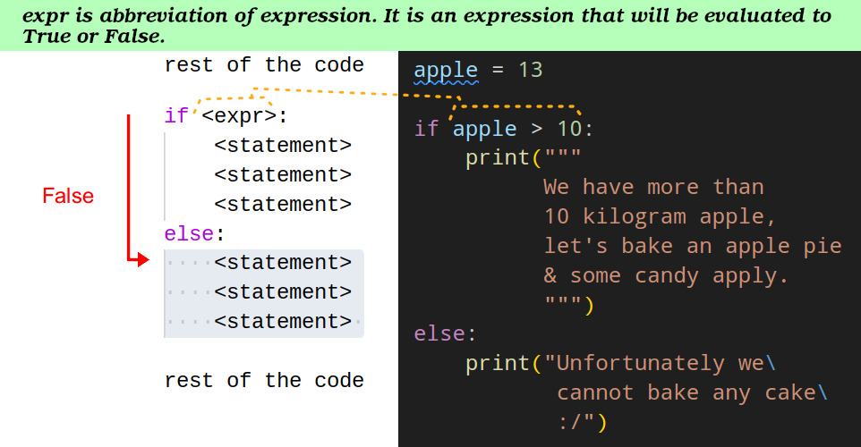

# Questions & Fixing Some Mistakes

- [What are binary numbers?](https://www.mathsisfun.com/binary-number-system.html)
- [What is ASCII?](https://en.wikipedia.org/wiki/ASCII)
- 

    
What does alias mean in computer science?

    
Two or more variables refer to the same value in memory.

  

- 

    
What is the difference between methods and functions in Python?

    <ul>
      <li>Both are a set of instructions telling computers what they need to do.</li>
      <li>A function is <b>NOT</b> associated to anything, e.g. <code>print("こにちは")</code>.</li>
      <li>A method is associated to another object, e.g. <code>"  こにちは\n\r\n\r".strip()</code>.</li>
    </ul>
  

- **NOTE**: `if` is **NOT** a function. [It is an statement](./most-common-statements.md#if-statement).
- 

    
What is an expression?

    
An expression is a combination of values, variables, operators, and calls to functions.

    
  

- 

    
How to escape the last `\` (back slash) in a raw string in Python?

    
<pre lang="python"><code>print(r"\\")</code></pre> or <pre lang="python"><code>print(r"\ ")</code></pre>

  

