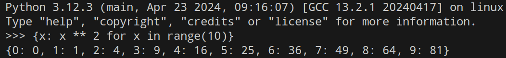
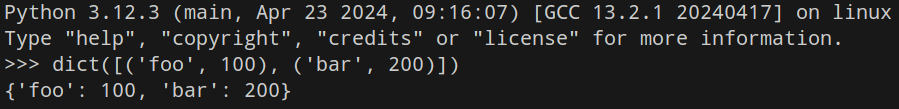
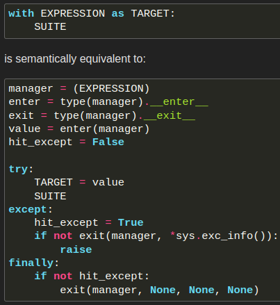
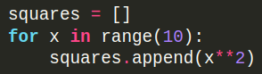
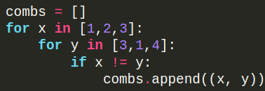

# OS

This module provides a portable way of using operating system dependent functionality.

## `os.system(command)`

Execute the command (a string) in a sub-shell. If command generates any output, it will be sent to the interpreter standard output stream.

The return value of the Python function is system-dependent.

-   On Unix, the return value is the exit status of the process encoded in the format specified for wait().
-   On Windows, the return value is that returned by the system shell after running command.

# `sys.exit()`

The optional argument arg can be an integer giving the exit status (defaulting to zero),

If it is an integer, zero is considered “successful termination” and any nonzero value is considered “abnormal termination” by shells and the like.

Most systems require it to be in the range 0-127, and produce undefined results otherwise.

Cleanup actions specified by `finally` clauses of `try` statements are honored, and it is possible to intercept the exit attempt at an outer level.

Unlike `quit()` and `exit()`, `sys.exit()` is recommended for use in production code. It raises a `SystemExit` exception that can be caught and handled (Could not find any ref in the official doc :/).

# `len()`

# `try...except...else...finally` statement

The `try` statement specifies exception handlers and/or cleanup code for a group of statements

## `except` clause

The `except` clause(s) specify one or more exception handlers. Here the `Exception` is a common base class for all non-exit exceptions.

## `else` clause

The optional `else` clause is executed if the control flow leaves the `try` suite, no exception was raised, and no `return`, `continue`, or `break` statement was executed.

> [!CAUTION]
> Exceptions in the `else` clause **are not** handled by the preceding `except` clauses.

## `finally` clause

If `finally` is present, it specifies a 'cleanup' handler. When a `return`, `break` or `continue` statement is executed in the `try` suite of a _try…finally_ statement, the `finally` clause is also executed 'on the way out.'

1.  The `try` clause is executed.
2.  If an exception occurs in any of the clauses (does not matter where it was occurred; `try`, `else`, or `except`) and is not handled, the exception is temporarily saved.
3.  The `finally` clause is executed.
4.  If there is a saved exception it is re-raised at the end of the `finally` clause.
5.  If the `finally` clause raises another exception, the saved exception is set as the context of the new exception.
6.  If the `finally` clause executes a `return`, `break` or `continue` statement, the saved exception is discarded.

# `print()`

Print objects to the text stream file, separated by `sep` and followed by `end`. The `file` argument must be an object with a `write(string)` method; `sys.stdout` is the default value.

## `sys.stdin`, `sys.stdout`, `sys.stderr`

File objects used by the interpreter for standard input, output and errors:

-   `stdin` is used for all interactive input (including calls to `input()`).
-   `stdout` is used for the output of `print()` and expression statements and for the prompts of `input()`;
-   The interpreter's own prompts and its error messages go to `stderr`.

# `dict()`

Return a new dictionary initialized from an optional positional argument and a possibly empty set of keyword arguments.

-   Use a comma-separated list of key:
    -   `{'jack': 4098, 'ford': 4127}`
    -   `{4098: 'jack', 4127: 'ford'}`
-   Use a dict comprehension:

    -   `{}`
    -   `{x: x ** 2 for x in range(10)}`

    

-   Use the type constructor:

    -   `dict()`
    -   `dict([('foo', 100), ('bar', 200)])`
    -   `dict(foo=100, bar=200)`

    

# `open(file, mode='r', buffering=-1, encoding=None, errors=None, newline=None, closefd=True, opener=None)`

Open file and return a corresponding file object. If the file cannot be opened, an `OSError` is raised. `file` is a path-like object giving the pathname (absolute or relative to the current working directory) of the file to be opened. `mode` is an optional string that specifies the mode in which the file is opened. It defaults to `'r'` which means open for reading in text mode (Read more in the official doc).

> [!TIP]
>
> It is good practice to use the `with` keyword when dealing with file objects. The advantage is that the file is properly closed after its suite finishes, even if an exception is raised at some point. Using with is also much shorter than writing equivalent _try-finally_ blocks:
>
> ```py
> with open('workfile', encoding="utf-8") as f:
>     read_data = f.read()
> ```

# Format String

The `str.format()` method and the `Formatter` class share the same syntax for format strings.

## `str.format(*args, **kwargs)`

Perform a string formatting operation.

-   The string on which this method is called can contain _literal text_ or _replacement fields_ delimited by braces `{}`.
-   Each replacement field contains either the numeric index of a positional argument, or the name of a keyword argument.
-   Returns a copy of the string where each replacement field is replaced with the string value of the corresponding argument.

## f-strings

A _formatted string literal_ or _f-string_ is a string literal that is prefixed with 'f' or 'F'. These strings may contain replacement fields, which are expressions delimited by curly braces `{}`.

> [!IMPORTANT]
>
> While other string literals always have a constant value, formatted strings are really expressions **evaluated at run time**.

### Examples:

```python
today = datetime(year=2017, month=1, day=27)
print(f"{today:%B %d, %Y}") # 'January 27, 2017'
# When the equal sign '=' is provided, the output will have the expression text, the '=' and the evaluated value.
print(f"{today=:%B %d, %Y}")
# We can specify the width after color
line = "The mill's closed"
print(f"{line:20}") # "The mill's closed   "
# Reusing the outer f-string quoting type inside a replacement field is permitted:
a = dict(x=2)
print(f"abc {a["x"]} def") # 'abc 2 def'
```

# `with`

The `with` statement is used to wrap the execution of a block with methods defined by a context manager. This allows common _try…except…finally_ usage patterns to be encapsulated for convenient reuse.



# List comprehension

A concise way to create lists. Common applications are to make new lists where each element is the result of some operations applied to each member of another sequence or iterable, or to create a subsequence of those elements that satisfy a certain condition.

| Traditional way               | lambda                                           | short version of lambda               |
| ----------------------------- | ------------------------------------------------ | ------------------------------------- |
|  | `squares = list(map(lambda x: x**2, range(10)))` | `squares = [x**2 for x in range(10)]` |

It consist of _brackets_ containing:

1. An _expression_.
2. Followed by a `for` clause.
3. Then zero or more `for` or `if` clauses.

The result will be a new list resulting from evaluating the expression in the context of the for and if clauses which follow it.

| Traditional way                    | Short version                                          |
| ---------------------------------- | ------------------------------------------------------ |
|  | `[(x, y) for x in [1,2,3] for y in [3,1,4] if x != y]` |

> [!NOTE]
>
> Pay attention to how the order of the `for` and `if` statements is the same in both these snippets.

```py
[ (value, key) for key, value in word_counter.items() ]
```

In this lovely code we are not using append or listing the list elements one by one. But instead we are giving it an expression that acts as a generator. So it loop over the `word_counter` and reverse its key-value pair in new tuples. And for each key-value it adds a new reversed tuple to the list.

So this list is manufactured on the fly. And JFI the sorted accepts a list and a list of tuples are sortable too.

## Tuples

-   A tuple consists of a number of values separated by commas.
    ```py
    t = 12345, 54321, 'hello!'
    ```
-   They are immutable but they can contain mutable objects.
    ```py
    t = 12345, 54321, 'hello!'
    t[0] = 88888
    # Traceback (most recent call last):
    #   File "<stdin>", line 2, in <module>
    # TypeError: 'tuple' object does not support item assignment
    ```
-   They may be nested
    ```py
    t = 12345, 54321, 'hello!'
    u = t, (1, 2, 3, 4, 5) # ((12345, 54321, 'hello!'), (1, 2, 3, 4, 5))
    ```
-   Empty tuples are constructed by an empty pair of parentheses
    ```py
    empty_tuple = ()
    ```
-   A tuple with one item is constructed by following a value with a comma
    ```py
    single_tuple = 'hello',
    ```
-   Sequence unpacking: It requires that there are as many variables on the left side of the equals sign as there are elements in the sequence.
    ```py
    t = 12345, 54321, 'hello!'
    x, y, z = t
    ```
